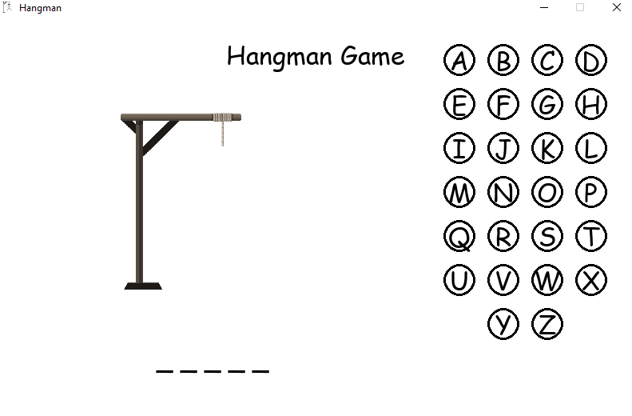

# Hangman 

## Description
Program that allows the user to play the classic game of Hangman. The user is prompted to enter a word, and the program will display a partially completed word, as well as the number of incorrect guesses remaining. The user is prompted to guess a letter, and the program will respond appropriately. If the user guesses a letter that is not in the word, the program will display the incorrect guess count, and the user will be prompted to guess another letter. If the user guesses a letter that is in the word, the program will display the partially completed word, and the user will be prompted to guess another letter. If the user guesses all the letters in the word, the program will display the completed word, and the user will be prompted to play again.

## Anggota Kelompok RD-07
|        NAMA         |     NIM    |
| ------------------- | ---------- |
| Pandu Firmanto      | 120140020  |
| Nashirotul Maftuha  | 120140031  |
| Adi Sulaksono       | 120140038  |
| Lidia Alvionisya    | 120140042  |
| Devi Kurnia         | 120140060  |
| Hanif Putra Agusta  | 120140120  |

- Alpha Ver. 0.1.2